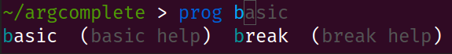

Git Bash Support
----------------
Due to limitations of file descriptor inheritance on Windows, Git Bash not supported out of the box. You can opt in to
using temporary files instead of file descriptors for for IPC by setting the environment variable
``ARGCOMPLETE_USE_TEMPFILES``, e.g. by adding ``export ARGCOMPLETE_USE_TEMPFILES=1`` to ``~/.bashrc``.

For full support, consider using Bash with the Windows Subsystem for Linux (WSL).

Fish Support
------------
To activate completions for fish use::

    register-python-argcomplete --shell fish my-awesome-script | source

or create new completion file, e.g::

    register-python-argcomplete --shell fish my-awesome-script > ~/.config/fish/completions/my-awesome-script.fish

Completion Description For Fish
~~~~~~~~~~~~~~~~~~~~~~~~~~~~~~~
By default help string is added as completion description.

You can disable this feature by removing ``_ARGCOMPLETE_DFS`` variable, e.g::

    register-python-argcomplete --shell fish my-awesome-script | grep -v _ARGCOMPLETE_DFS | source

PowerShell Support
------------------
To activate completions for PowerShell use::

    register-python-argcomplete --shell powershell my-awesome-script | Out-String | Invoke-Expression

or create new completion file, e.g::

    register-python-argcomplete --shell powershell my-awesome-script > ~/my-awesome-script.psm1

To activate this completions file, add the below line in ``$PROFILE``. The simplest way is to run ``notepad $PROFILE`` in PowerShell and edit the file. For more information, see `How to create your profile <https://learn.microsoft.com/en-us/powershell/module/microsoft.powershell.core/about/about_profiles?view=powershell-7.3#how-to-create-a-profile>`_ and `Profiles and execution policy <https://learn.microsoft.com/en-us/powershell/module/microsoft.powershell.core/about/about_profiles?view=powershell-7.3#profiles-and-execution-policy>`_. ::

    Import-Module  "~/my-awesome-script.psm1"

Xonsh support
-------------
The third-party `xontrib-argcomplete <https://github.com/anki-code/xontrib-argcomplete>`_ project provides support for
argcomplete in the `xonsh <https://github.com/xonsh/xonsh>`_ shell.

External argcomplete script
---------------------------
To register an argcomplete script for an arbitrary name, the ``--external-argcomplete-script`` argument of the
``register-python-argcomplete`` script can be used::

    eval "$(register-python-argcomplete --external-argcomplete-script /path/to/script arbitrary-name)"

This allows, for example, to use the auto completion functionality of argcomplete for an application not written in
Python. The command line interface of this program must be additionally implemented in a Python script with argparse and
argcomplete; whenever the application is called, the registered external argcomplete script is used for autocompletion.
